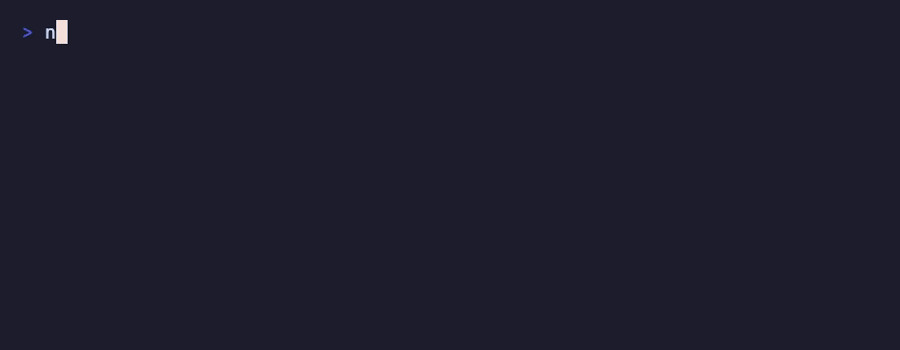

# BlockWatch

[](https://github.com/mennanov/blockwatch/actions)
[](https://codecov.io/gh/mennanov/blockwatch)
[](https://crates.io/crates/blockwatch)
[](https://crates.io/crates/blockwatch)

BlockWatch is a linter that keeps your code, documentation, and configuration in sync and enforces strict formatting and
validation rules.

<p>
  
</p>

It helps you avoid broken docs and messy config files by enforcing rules directly in your comments. You can link code to
documentation, auto-sort lists, ensure uniqueness, and even validate content with Regex or AI.

It works with almost any language (Rust, Python, JS, Go, Markdown, YAML, etc.) and can run on your entire repo or just
your VCS diffs.

## Features

[//]: # (<block name="available-validators">)

- **Drift Detection**: Link a block of code to its documentation. If you change the code but forget the docs, BlockWatch
  alerts you.
- **Strict Formatting**: Enforce sorted lists (`keep-sorted`) and unique entries (`keep-unique`) so you don't have to
  nitpick in code reviews.
- **Content Validation**: Check lines against Regex patterns (`line-pattern`) or enforce block size limits (
  `line-count`).
- **AI Rules**: Use natural language to validate code or text (e.g., "Must mention 'banana'").
- **Flexible**: Run it on specific files, glob patterns, or just your unstaged changes.

[//]: # (</block>)

## Installation

### Homebrew (macOS/Linux)

```shell
brew tap mennanov/blockwatch
brew install blockwatch
```

### From Source (Rust)

```shell
cargo install blockwatch
```

### Prebuilt Binaries

Check the [Releases](https://github.com/mennanov/blockwatch/releases) page for prebuilt binaries.

## Quick start example

1. Add a special `block` tag in the comments in any supported file ([See *Supported Languages*](#supported-languages))
   like this:

   ```python
   user_ids = [
       # <block keep-sorted keep-unique>
       "cherry",
       "apple",
       "apple",
       "banana",
       # </block>
   ]
   ```

2. Run `blockwatch`:

   ```shell
   blockwatch
   ```

   BlockWatch will fail and tell you that the list is not sorted and has duplicate entries.

3. Fix the order and uniqueness:

   ```python
   user_ids = [
       # <block keep-sorted keep-unique>
       "apple",
       "banana",
       "cherry",
       # </block>
   ]
   ```

4. Run `blockwatch` again:

   ```shell
   blockwatch
   ```

   Now it passes!

## How It Works

You define rules using HTML-like tags inside your comments.

### Linking Code Blocks (`affects`)

This ensures that if you change some block of code, you're forced to look at the other blocks too.

**src/lib.rs**:

```rust
// <block affects="README.html:supported-langs">
pub enum Language {
    Rust,
    Python,
}
// </block>
```

**README.html**:

```html
<!-- <block name="supported-langs"> -->
<ul>
    <li>Rust</li>
    <li>Python</li>
</ul>
<!-- </block> -->
```

If you modify the enum in `src/lib.rs`, BlockWatch will fail until you touch the corresponding block `supported-langs`
in `README.html` as well.

### Enforce Sort Order (`keep-sorted`)

Keep lists alphabetized. Default is `asc` (ascending).

```python
# <block keep-sorted>
"apple",
"banana",
"cherry",
# </block>
```

If the list is not sorted alphabetically, BlockWatch will fail until you fix the order.

#### Sort by Regex

You can sort by a specific part of the line using a regex capture group named `value`.

```python
items = [
    # <block keep-sorted="asc" keep-sorted-pattern="id: (?P<value>\d+)">
    "id: 1  apple",
    "id: 2  banana",
    "id: 10 orange",
    # </block>
]
```

#### Numeric Sort (`keep-sorted-format`)

By default, values are compared lexicographically (as strings). This means `"10"` sorts before `"2"` because `"1" < "2"`
character-by-character. Use `keep-sorted-format="numeric"` to compare values as numbers instead.

```python
numbers = [
    # <block keep-sorted keep-sorted-format="numeric">
    2
    10
    20
    # </block>
]
```

This works with `keep-sorted-pattern` to extract numeric values from lines with mixed content:

```python
items = [
    # <block keep-sorted keep-sorted-format="numeric" keep-sorted-pattern="id: (?P<value>\d+)">
    "id: 2  banana",
    "id: 10 orange",
    "id: 20 apple",
    # </block>
]
```

Without `keep-sorted-format="numeric"`, the example above would fail because `"10"` is lexicographically less than
`"2"`.

### Enforce Unique Lines (`keep-unique`)

Prevent duplicates in a list.

```python
# <block keep-unique>
"user_1",
"user_2",
"user_3",
# </block>
```

#### Uniqueness by Regex

Just like sorting, you can check uniqueness based on a specific regex match.

```python
ids = [
    # <block keep-unique="^ID:(?P<value>\d+)">
    "ID:1 Alice",
    "ID:2 Bob",
    "ID:1 Carol",  # Violation: ID:1 is already used
    # </block>
]
```

### Regex Validation (`line-pattern`)

Ensure every line matches a specific regex pattern.

```python
slugs = [
    # <block line-pattern="^[a-z0-9-]+$">
    "valid-slug",
    "another-one",
    # </block>
]
```

### Enforce Line Count (`line-count`)

Enforce the number of lines in a block.
Supported operators: `<`, `>`, `<=`, `>=`, `==`.

```python
# <block line-count="<=5">
"a",
"b",
"c"
# </block>
```

### Validate with AI (`check-ai`)

Use an LLM to validate logic or style.

```html
<!-- <block check-ai="Must mention the company name 'Acme Corp'"> -->
<p>Welcome to Acme Corp!</p>
<!-- </block> -->
```

#### Targeted AI Checks

Use `check-ai-pattern` to send only specific parts of the text to the LLM.

```python
prices = [
    # <block check-ai="Prices must be under $100" check-ai-pattern="\$(?P<value>\d+)">
    "Item A: $50",
    "Item B: $150",  # Violation
    # </block>
]
```

#### Supported environment variables

[//]: # (<block name="check-ai-env-vars">)

- `BLOCKWATCH_AI_API_KEY`: API Key.
- `BLOCKWATCH_AI_MODEL`: Model name (default: `gpt-5-nano`).
- `BLOCKWATCH_AI_API_URL`: Custom OpenAI compatible API URL (optional).

[//]: # (</block>)

## Usage

### Run Locally

Validate all blocks in your project:

```shell
# Check everything
blockwatch

# Check specific files
blockwatch "src/**/*.rs" "**/*.md"

# Ignore stuff
blockwatch "**/*.rs" --ignore "**/generated/**"
```

> **Tip:** Glob patterns should be quoted to avoid shell expanding them.

### Check Only What Changed

Pipe a git diff to BlockWatch to validate only the blocks you touched. This is perfect for pre-commit hooks.

```shell
# Check unstaged changes
git diff --patch | blockwatch

# Check staged changes
git diff --cached --patch | blockwatch

# Check changes in a specific file only
git diff --patch path/to/file | blockwatch

# Check changes and some other (possibly unchanged) files
git diff --patch | blockwatch "src/always_checked.rs" "**/*.md"
```

### Listing Blocks

You can list all blocks that BlockWatch finds without running any validation. This is useful for auditing your blocks or
debugging your configuration.

```shell
# List all blocks in the current directory
blockwatch list

# List blocks in specific files
blockwatch list "src/**/*.rs" "**/*.md"

# List only blocks affected by current changes
git diff | blockwatch list
```

The output is a JSON object.

#### Example Output

[//]: # (<block name="list-output-example">)

```json
{
  "README.md": [
    {
      "name": "available-validators",
      "line": 18,
      "column": 10,
      "is_content_modified": false,
      "attributes": {
        "name": "available-validators"
      }
    }
  ]
}
```

[//]: # (</block>)

### CI Integration

#### Pre-commit Hook

Add this to `.pre-commit-config.yaml`:

```yaml
- repo: local
  hooks:
    - id: blockwatch
      name: blockwatch
      entry: bash -c 'git diff --patch --cached --unified=0 | blockwatch'
      language: system
      stages: [ pre-commit ]
      pass_filenames: false
```

#### GitHub Action

Add this to `.github/workflows/your_workflow.yml`:

```yaml
- uses: mennanov/blockwatch-action@v1
```

## Supported Languages

BlockWatch supports comments in:

[//]: # (<block name="supported-grammar" keep-sorted="asc">)

- Bash
- C#
- C/C++
- CSS
- Go (with `go.mod`, `go.sum` and `go.work` support)
- HTML
- Java
- JavaScript
- Kotlin
- Makefile
- Markdown
- PHP
- Python
- Ruby
- Rust
- SQL
- Swift
- TOML
- TypeScript
- XML
- YAML

[//]: # (</block>)

## CLI Options

[//]: # (<block name="cli-docs">)

- **List Blocks**: `blockwatch list` outputs a JSON report of all found blocks.
- **Extensions**: Map custom extensions: `blockwatch -E cxx=cpp`
- **Disable Validators**: `blockwatch -d check-ai`
- **Enable Validators**: `blockwatch -e keep-sorted`
- **Ignore Files**: `blockwatch --ignore "**/generated/**"`

[//]: # (</block>)

## Known Limitations

- Deleted blocks are ignored.
- Files with unsupported grammar are ignored.

## Contributing

Contributions are welcome! A good place to start is
by [adding support for a new grammar](https://github.com/mennanov/blockwatch/pull/2).

### Run Tests

```shell
cargo test
```
