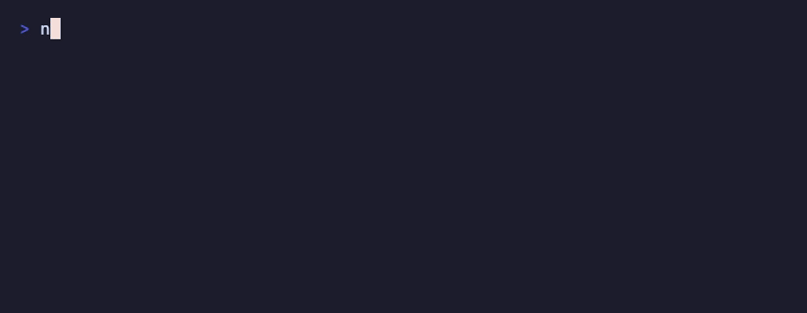

# BlockWatch

[](https://github.com/mennanov/blockwatch/actions)
[](https://codecov.io/gh/mennanov/blockwatch)
[](https://crates.io/crates/blockwatch)
[](https://crates.io/crates/blockwatch)

BlockWatch is a language-agnostic linter that keeps co-dependent code, documentation, and configuration files in sync.
Rules are declared in comments right next to the code they protect.

<p>
  
</p>

## Quick Start

Add `<block>` tags inside comments in any [supported file](#supported-languages):

**src/lib.rs**:

```rust
// <block affects="README.html:supported-langs">
pub enum Language {
    Rust,
    Python,
}
// </block>
```

**README.html**:

```html
<!-- <block name="supported-langs"> -->
<ul>
    <li>Rust</li>
    <li>Python</li>
</ul>
<!-- </block> -->
```

If you add a new variant to `Language` in `src/lib.rs` without modifying `README.html`, BlockWatch will report an error.

The [`affects`](docs/validators/affects.md) validator ensures linked blocks are modified together, while [
`same-as`](docs/validators/same-as.md) verifies that they agree.

When a diff is piped in, only the blocks that diff touched are validated. Adding a rule never fails anyone else's work,
so you can annotate an existing codebase one file at a time instead of fixing every pre-existing violation up front.

## Validators

[//]: # (<block name="available-validators">)

| Attribute                                         | Description                                                      |
|---------------------------------------------------|------------------------------------------------------------------|
| [`affects`](docs/validators/affects.md)           | Ensures linked blocks are updated together (e.g. code and docs)  |
| [`same-as`](docs/validators/same-as.md)           | Verifies that two or more blocks contain identical values        |
| [`keep-sorted`](docs/validators/keep-sorted.md)   | Enforces alphabetical or numerical ordering on list items        |
| [`keep-unique`](docs/validators/keep-unique.md)   | Prevents duplicate lines within a block                          |
| [`line-pattern`](docs/validators/line-pattern.md) | Enforces that every line matches a specified regex               |
| [`line-count`](docs/validators/line-count.md)     | Enforces lower or upper bounds on the number of lines in a block |
| [`check-ai`](docs/validators/check-ai.md)         | Validates content against natural language rules using an LLM    |
| [`check-lua`](docs/validators/check-lua.md)       | Runs custom validation logic written in Lua                      |

[//]: # (</block>)

Blocks also support `name` (for reference by `affects` or `same-as`) and [
`severity`](docs/validators/README.md#severity) (e.g., `severity="warning"` to log warnings without breaking builds
during gradual rollouts).

See the [Validators Reference](docs/validators/README.md) for full details.

## Installation

```shell
brew install mennanov/blockwatch/blockwatch   # macOS / Linux
cargo install blockwatch                      # from source
```

Prebuilt binaries are also available on the [Releases](https://github.com/mennanov/blockwatch/releases) page.

## AI Agent Integration

Adding `<block>` tags to an existing codebase can be automated using AI coding tools. This repository includes
a [skill](.agents/skills/blockwatch/SKILL.md) that instructs agents on how to identify candidate blocks and verify their
edits.

For **Claude Code**:

```text
/plugin marketplace add mennanov/blockwatch
/plugin install blockwatch@blockwatch
```

For Cursor, Copilot, Codex, and other setup options, see [docs/agents.md](docs/agents.md).

## Usage

A bare run checks the whole repository. Pass `--diff` to read a unified diff from stdin, which marks the blocks it
changed, and add `--only-changed` to narrow the run down to those blocks:

```shell
# Check every block in the repository
blockwatch

# Check specific globs
blockwatch "src/**/*.rs" "**/*.md"

# Check every block, and enforce the rules that need a diff, such as `affects`
git diff --patch | blockwatch --diff

# Check only the blocks the diff changed
git diff --patch | blockwatch --diff --only-changed

# The same, for staged changes
git diff --cached --patch | blockwatch --diff --only-changed

# Dump all discovered blocks as JSON
blockwatch list
```

See [docs/cli.md](docs/cli.md) for the run modes in full, CLI flags, path exclusions, and custom extension mappings.

## CI Integration

**pre-commit** (`.pre-commit-config.yaml`):

```yaml
- repo: https://github.com/mennanov/blockwatch
  rev: v0.2.27  # Use latest release
  hooks:
    - id: blockwatch
```

**GitHub Actions**:

```yaml
- uses: mennanov/blockwatch-action@v1
```

For plain git hooks, local pre-commit setups, and sandboxing untrusted Lua scripts in fork PRs,
see [docs/ci.md](docs/ci.md).

## Supported Languages

[//]: # (<block name="supported-grammar" keep-sorted="asc">)

- Bash
- C#
- C/C++
- CMake (`CMakeLists.txt`, `.cmake`)
- CSS
- Dart
- Dockerfile (with `Containerfile` and `.dockerfile` support)
- Elixir (`.ex`, `.exs`)
- Go (with `go.mod`, `go.sum` and `go.work` support)
- GraphQL (`.graphql`, `.gql`)
- Groovy (with `.gradle` and `Jenkinsfile` support)
- HCL (Terraform: `.tf`, `.tfvars`, `.hcl`)
- HTML
- Java
- JavaScript
- Kotlin
- Lua
- Makefile
- Markdown
- Nix
- PHP
- Protocol Buffers (`.proto`)
- Python
- Ruby
- Rust
- SQL
- Scala (with `.sbt` support)
- Starlark (Bazel: `BUILD`, `WORKSPACE`, `MODULE.bazel`, `.bzl`, `.bzlmod`, `.star`)
- Swift
- TOML
- TypeScript
- XML
- YAML

[//]: # (</block>)

To map custom or unknown extensions to a supported syntax, use `-E`:

```shell
blockwatch -E cxx=cpp
```

## Known Limitations

- Deleted blocks are currently ignored.
- Files with unsupported comment syntaxes are ignored.
- Text inside the JSON form of a Dockerfile instruction (`CMD ["…"]`) can be mistaken for a comment: a `#` inside the
  quotes is treated as the start of a comment, so a `<block>` tag written inside such a string is picked up as a real
  rule:

  ```dockerfile
  CMD ["sh", "-c", "# <block name='example'> ..."]
  ```

  BlockWatch lists a block named `example` here and tries to enforce it, even though it is only text inside a
  string. Every other supported language ignores tags written inside strings. Tracked in
  [#119](https://github.com/mennanov/blockwatch/issues/119).

## Contributing

Contributions are welcome! A great first issue
is [adding support for a new grammar](https://github.com/mennanov/blockwatch/pull/2).

To run tests locally:

```shell
cargo test
```
